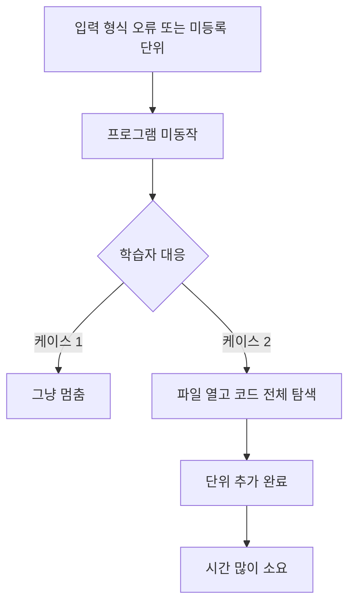

# UnitConverter_24 — 문제 정의 보고서

| 항목 | 내용 |
|------|------|
| 문서 번호 | 01 |
| 프로젝트 | UnitConverter_24 |
| 방법 | Mom Test 기반 문제 정의 |
| 페르소나 | 길이 단위 변환을 손으로/코드로 다루는 학습자 |
| 작성 일자 | 2026-06-05 |
| 근거 Transcript | `prompting/01_UnitConvertor_MomTest_transcript.md` |
| 근거 인터뷰 보고서 | `report/01_UnitConvertor_MomTest_report.md` |
| PRD | `docs/PRD.md` |

---

## 1. 요약

UnitConverter_24의 핵심 문제는 **「단위 변환 프로그램이 없다」**가 아니라, **입력 형식(`unit:value`)과 지원 단위 규칙이 코드 여러 곳에 분산**되어 있어 실패·탐색·중단 비용이 크다는 점이다. 이번 세션의 산출 범위는 구현 전체가 아니라 **8계층 중 Rule, Command, (Skill), Test Loop**를 정의하는 것이다.

---

## 2. 표면 문제 vs 진짜 문제

### 2.1 표면 문제 (잘못된 정의)

「길이 단위 변환 **프로그램을 만든다**」「단위 추가 **기능을 넣는다**」처럼, 제품·기능 이름으로 문제를 정의하는 것.

### 2.2 진짜 문제 (한 문장)

입력 형식(`meter:2.5`)과 지원 단위가 코드 여러 곳에 묻혀 있어, 형식을 틀리거나 미등록 단위를 쓰면 **동작 실패**가 나고, 단위를 추가할 때 **어디를 고쳐야 하는지 찾는 데 시간이 많이 들며**, 어려우면 **작업을 그만둔다**.

### 2.3 Mom Test 증거 3줄

1. 「다른 형식으로 넣어서 **문제가 생겼어**」
2. 「프로그램이 **제대로 동작하지 않았어**」 / 「등록하지 않은 단위로 변환하려고 했더니 **역시 문제가 발생**했어」
3. 「**그냥 멈췄어**」 / 「변환 단위가 추가될 때마다 기존 코드를 수정할 곳이 **많아서 헷갈렸어**」 / 「**끝냈지만 시간이 오래 걸렸어**」

---

## 3. 주제 한 문장 (Mom Test, 솔루션 최소화)

**입력 형식(`unit:value`)과 지원 단위 규칙이 한곳에서 드러나지 않아 실패·탐색·중단 비용이 큰 상황을, 실패 직후 원인·허용 형식이 분명해지고 단위 추가 시 수정 지점이 한곳으로 모이도록 줄인다.**

---

## 4. R-G-I-O

| 항목 | 내용 |
|------|------|
| **Role** | `src/cli.py` 및 `src/` 레이어를 실행·수정하는 **학습자** (길이 변환을 코드로 다루는 페르소나) |
| **Goal** | `unit:value`로 값을 넣었을 때 **지원 단위면 변환 결과를 얻고**, 형식·단위가 틀리면 **왜 실패했는지 바로 알 수 있으며**, 단위를 늘릴 때 **어디만 고치면 되는지 헷갈리지 않게** 한다 |
| **Input** | CLI 한 줄 문자열 `unit:value` (예: `meter:2.5`); 현재 지원 단위: meter, feet, yard |
| **Output** | **성공:** 입력 단위 기준 meter·feet·yard 변환 줄 출력 / **실패:** 형식·숫자·미등록 단위를 구분한 메시지 후 종료 |

### 4.1 현재 코드와의 연결

| 학습자 pain | 코드/README 현상 |
|-------------|------------------|
| 입력 형식 혼란 | `unit:value` 규칙이 프롬프트·README에만 문서화 |
| 미등록 단위 | `if/elif` + `else` 분기, 단위 목록이 `main()`에 하드코딩 |
| 추가 위치 헷갈림 | 변환 계수·분기·출력이 한 모듈에 결합 (레거시 단일 파일) |
| 검증 부재 | README는 TC 작성 요구 → `tests/domain/` Harness 확보 |

**레거시 baseline:** 단일 파일에 `if unit == "meter"` 분기·`3.28084` 리터럴 산재.  
**목표 구조:** `config/units.json` + `src/application`(파싱) · `src/domain`(검증·변환) · `src/cli.py` (PRD §5.0 · §10.1).

---

## 5. 성공 기준 3개 (Mom Test 증거 연결)

| # | 성공 기준 (검증 가능) | 연결 증거 |
|---|----------------------|-----------|
| **S1** | `unit:value`가 아닌 입력·미등록 단위 실행 시, **형식 오류 / 숫자 오류 / unknown unit**이 구분되어 나오고, 허용 형식·지원 단위 힌트가 메시지에 포함된다 | 「다른 형식으로 넣어서 문제가 생겼어」 / 「등록하지 않은 단위… 역시 문제」 |
| **S2** | 지원 단위 3종에 대해 meter 기준 변환 결과가 **테스트로 고정 검증**되며, 회귀 시 실패가 바로 드러난다 | 「프로그램이 제대로 동작하지 않았어」— 실패를 **재현·차단**하는 루프 |
| **S3** | 새 단위 1개 추가 시 변경 파일·함수·설정 **지점이 문서화된 한 곳**에만 있고, `if/elif`·출력·계수를 여러 곳에 복붙하지 않는다 | 「수정할 곳이 많아서 헷갈렸어」 / 「끝냈지만 시간이 오래 걸렸어」 |

> S3는 완성된 OCP 리팩터가 아니라, Rule·Command·Test Loop에 **「단위 추가 = 이 파일/이 블록만」**이 명시되면 1차 충족 가능하다.

---

## 6. 이번 프로젝트에서 하지 않을 것 (표면 문제·과잉 범위)

| 하지 않을 것 | 이유 |
|--------------|------|
| 문제를 「길이 단위 변환 **앱/프로그램**을 만든다」「**단위 추가 기능**을 넣는다」로만 정의 | Mom Test 진짜 문제는 **기능 부재**가 아니라 **규칙·단위의 분산과 실패/탐색 비용** |
| README **추가 요구 3종**을 기본(S1~S3) **없이** 먼저 일괄 구현 | `docs/PRD.md` v0.2: **M2 → M4** 순서(IS-9→8→7); 8계층·Test Loop 선행 |
| GUI·웹 API·운영 배포 파이프라인 | PRD §4.2 **OS-4·OS-6** — 본 프로젝트 제외 |
| OCP/SRP **용어 설명만**으로 완료 선언 | 학습자 언어는 「헷갈림」「멈춤」「오래 걸림」— S1~S3·Test Loop로 연결해야 함 |
| 에러 메시지 1줄 추가만으로 “해결” 주장 | 메시지 존재 ≠ 멈추지 않음; **single source of truth**가 핵심 |
| Mom Test에서 **미확인**인 항목을 필수 성공 기준에 넣기 (멈춘 뒤 대안 사용, 정확한 소요 분) | 증거에 없음 — 후속 인터뷰·선택 지표 |

---

## 7. 8계층 — 이번 세션 산출 (Rule / Command / Skill / Test Loop)

이번 세션에서 **만드는 계층만** 정의한다. 나머지 계층(전체 앱 스캐폴드, 배포, UI 등)은 후속 세션으로 미룬다.

### 7.1 Rule (규칙 계층)

AI·학습자가 코드를 수정할 때 Mom Test 진짜 문제를 벗어나지 않게 하는 **불변 제약**.

| ID | 규칙 |
|----|------|
| R1 | 입력 계약은 **`unit:value` 한 가지**; `:` 없음·빈 단위·비숫자 값은 **서로 다른** 메시지로 구분한다. |
| R2 | **지원 단위 목록과 meter 환산 계수**는 코드 또는 설정 **한 곳**에서만 정의한다. `main()`에 `if unit == "meter"` 형태의 분기를 **추가하지 않는다**. |
| R3 | 단위 추가 시 **수정 허용 파일/블록**은 Command·PRD에 명시한 곳만 변경한다. |
| R4 | 표면 목표(「기능 추가」) 제안 시 **진짜 문제 문장**(§2.2)으로 범위를 되돌린다. |
| R5 | 변환 비율은 README 비즈니스 로직과 일치한다: `1 meter = 3.28084 feet`, `1 meter = 1.09361 yard`. |

### 7.2 Command (명령 계층)

Agent·학습자가 실행할 **순서 있는 작업**.

| 순서 | 명령 |
|------|------|
| C1 | `src/`·레거시에서 **형식 검증 / 단위 분기 / 출력 / 계수** 분산 지점 목록화한다. |
| C2 | **단일 출처**를 `config/units.json` + `src/domain` registry로 정한다. |
| C3 | `src/cli.py` I/O · `src/application` 파싱·use case · `src/domain` 검증·변환 (SRP, PRD §5.0). |
| C4 | Test Loop에 맞춰 실패 케이스 TC를 **먼저** 작성한다 (잘못된 형식, unknown unit, 정상 1건). |
| C5 | 리팩터 후 TC 전부 green; 단위 1개 추가 **드라이런**은 diff가 **한 파일**인지 확인한다. |

### 7.3 Skill (선택 계층)

반복 프롬프트를 Cursor Skill 또는 `prompting/` 문서로 고정한다.

| 항목 | 내용 |
|------|------|
| 트리거 | UnitConverter_24, Mom Test, 단위 추가, OCP, 입력 검증 |
| 스킬에 포함할 것 | 진짜 문제 1문장, 표면 문제 금지 목록, S1~S4, M2→M4 순서, 수정 허용 경로 1곳, Test Loop 명령 |
| 대안 | Skill 파일 없이 `.cursor/rules` 또는 `prompting/02_*.md`로 Rule+Command 이관 가능 |

### 7.4 Test Loop (검증 루프 계층)

「그냥 멈췄어」 패턴을 **자동 재현**으로 막는 짧은 루프.

| 단계 | 내용 |
|------|------|
| **Red** | 형식 오류·`inch:1`·`meter:abc`·`meter:2.5` 정상 — 최소 4 TC (S1+S2) |
| **Green** | 변환 로직을 단일 모듈/registry로 옮긴 뒤 TC 통과 |
| **Refactor** | 단위 1개(mock) 추가 TC만 추가; **기존 TC는 변경하지 않음** (S3) |
| **Exit** | S1 메시지 구분, S2 전 단위 수치, S3 “추가 diff 1파일” 체크리스트 통과 |

---

## 8. Pain Point → 설계 시사점

1. **실패가 학습 기회가 되려면** “무엇이 틀렸는지”와 “어떻게 써야 하는지”가 실패 직후 드러나야 한다 (S1).
2. **단위·형식 규칙은 한곳에서 discoverable**해야 한다 (S3, R2).
3. **중단 행동**은 need 강도 신호다; 변환 결과의 긴급도는 후속 인터뷰로 보완한다.
4. README 품질 목표(OCP, SRP, 테스트, 설정 외부화)는 인터뷰 pain과 **방향적으로 일치**한다.

---

## 9. 결론

문제 정의의 중심은 **분산된 규칙과 코드 구조 → 실패·탐색·중단 비용**이다. 구현·PRD 상세는 `docs/PRD.md`(v0.2)를 따르며, 범위는 **기본 요구(S1~S3)** 와 README **추가 요구(IS-7~9, FR-4~6, S4)** 를 포함한다. Rule·Command·Test Loop 문서화와 M2→M4 구현 순서가 정합해야 한다.

---

## 부록: 문서 관계

| 문서 | 역할 |
|------|------|
| `prompting/01_UnitConvertor_MomTest_transcript.md` | 원본 인터뷰 |
| `report/01_UnitConvertor_MomTest_report.md` | Mom Test 분석 |
| `report/01.UnitConvertor_ProblemDefinition_Report.md` | 본 문서 — 문제·성공 기준·8계층 |
| `docs/PRD.md` | 제품 요구사항·범위·수용 기준 (v0.2: IS-7~9·FR-4~6·S4 포함) |
