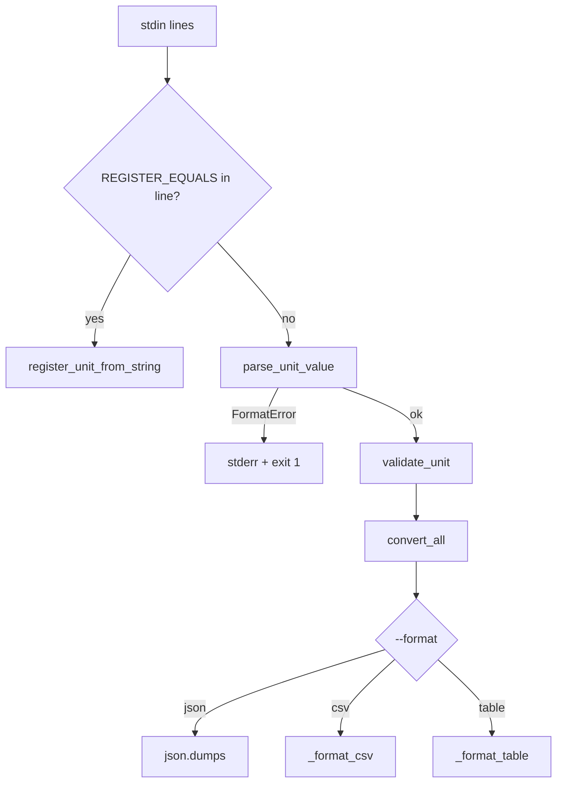

# UnitConverter_24 — TDD GREEN 단계 보고서

| 항목 | 내용 |
|------|------|
| 문서 번호 | 03 |
| 프로젝트 | UnitConverter_24 |
| 단계 | Dual-Track TDD — **GREEN 완료 (Logic + UI 핵심)** |
| 방법 | Test Loop Green — RED 실패 TC 최소 구현 (PRD §8·§9) |
| 작성 일자 | 2026-06-05 |
| 근거 Transcript | `prompting/05_UnitConvertor_TDD_GREEN_transcript.md` |
| PRD | `docs/PRD.md` v0.2.2 |
| 테스트 ID SSOT | `.cursor/skills/unit-converter-tdd/reference.md` |
| 브랜치 | `green` (7 commits, RED `58a3bee` 이후) |

---

## 1. 요약

RED Harness(15 TC) 이후 **Logic Track 7건·UI Track 7건**을 GREEN으로 전환했다. 세션 종료 시 **`python -m pytest tests/` — 14 passed, skip 0**이다.

**핵심 성과**

- **Logic:** registry 기반 변환(D-01)·파싱(D-02/D-04)·검증(D-03)·동적 등록(D-06)·설정 로드(D-05)·OCP 확장 검증(D-10)
- **UI:** JSON/CSV/표 3포맷(D-07~09)·Happy path(U-01)·동적 등록 CLI(U-03)·형식 오류 메시지(U-02)
- **SSOT:** 변환 계수는 `config/units.json` + registry; cli/application에 `3.28084` 리터럴 없음
- **Tooling:** `.cursor/commands/tdd-green.md` 추가 — RED 커맨드와 대칭 GREEN 절차

**본 세션에서 명시 GREEN하지 않았으나 green 상태인 TC:** **U-04** (D-07~09 포맷 구현의 부수 효과)

**다음 단계:** REFACTOR — formatting 분리, cli 오류 처리 통합, harness helper 공유, S3 diff 1파일 Exit 검증

---

## 2. 배경 및 목적

### 2.1 맥락

`report/02` RED 완료 후 `green` 브랜치에서 `/tdd-green` 커맨드를 반복 실행했다. 각 ID마다 **선언 → RED 재확인 → 최소 `src/` 구현 → scoped pytest → 회귀** 순서를 따랐다.

### 2.2 GREEN 완료 조건 (Skill · tdd-green.md)

| 조건 | 충족 |
|------|------|
| 대상 TC **PASSED** | ✅ (세션 대상 ID 전부) |
| skip / xfail 없음 | ✅ |
| assert 완화 없음 | ✅ (D-09/U-01은 **매칭 버그 수정**, 요구 완화 아님) |
| REFACTOR 선행 없음 | ✅ |
| ECB 레이어 의존 준수 | ✅ |

---

## 3. GREEN 매트릭스

### 3.1 Logic Track

| ID | Layer | 구현 요약 | RED → GREEN | 본 세션 |
|----|-------|-----------|-------------|---------|
| D-01 | domain | `UnitRegistry`, `convert_all` | ERROR → PASS | ✅ |
| D-02 | application | `parse_unit_value`, `FormatError` | ERROR → PASS | ✅ |
| D-03 | domain | `validate_unit`, `UnknownUnitError` | ERROR → PASS | ✅ |
| D-04 | application | `NumberError` 분기 | ERROR → PASS | ✅ |
| D-05 | infrastructure | `load_registry(json)` | ERROR → PASS | ✅ |
| D-06 | application | `parse_register_unit`, `register_unit_from_string` | ERROR → PASS | ✅ |
| D-10 | domain | *(코드 추가 없음)* D-01 OCP | ERROR → PASS | ✅ (D-01 부수) |

### 3.2 UI Track

| ID | Layer | 구현 요약 | RED → GREEN | 본 세션 |
|----|-------|-----------|-------------|---------|
| D-07 | cli | `--format json`, `config/units.json` | FAIL → PASS | ✅ |
| D-08 | cli | `--format csv`, `_format_csv` | FAIL → PASS | ✅ |
| D-09 | cli | default table, `_format_table` | FAIL → PASS | ✅ |
| U-01 | cli | D-09와 동일 경로 | FAIL → PASS | ✅ (harness만) |
| U-02 | cli | `FormatError` → stderr | FAIL → PASS | ✅ |
| U-03 | cli | multiline stdin 등록+변환 | FAIL → PASS | ✅ |
| U-04 | cli | 3포맷 동등 (NFR-5) | FAIL → PASS | ⬜ 전용 세션 없음 |

---

## 4. 아키텍처·설계 (GREEN 결과)

### 4.1 레이어 의존 (ECB)

```text
cli.py
  → application (parse_unit_value, register_unit_from_string)
  → domain (validate_unit, convert_all)
  → infrastructure (load_registry)
domain ← infrastructure (config_loader만 domain.registry import)
```

| 금지 | 준수 |
|------|------|
| domain → application/infrastructure/cli | ✅ |
| application → infrastructure/cli | ✅ |
| infrastructure → cli | ✅ |
| cli 변환 계수 리터럴 | ✅ |

### 4.2 OCP · SSOT

- **변환:** `convert_all`은 `registry.unit_names()` 순회만 — D-10 fixture `fathom` 등록으로 회귀 없이 확장 검증
- **계수:** `config/units.json` `meters_per_unit`; 테스트는 `tests/inputs.py` + fixture JSON
- **파싱 메시지:** application `FormatError`/`NumberError` — cli는 catch·출력만 (U-02)

### 4.3 CLI I/O 흐름 (GREEN 최종)



---

## 5. Harness·품질 이슈 및 조치

### 5.1 표 출력 TC 매칭 버그 (D-09 · U-01)

**증상:** `{value} meter = … {target}` 형식에서 `unit in line`이 source `meter` 때문에 3줄 모두 매칭.

**조치:** `line.rstrip().endswith(unit)` — **target 단위** 기준 1줄 매칭.

**판단:** assert 완화가 아닌 RED harness 오류 수정 (`.cursorrules` 출력 포맷과 정합).

### 5.2 `config/units.json` float 정밀도 (D-07)

**증상:** 수동 기입 `meters_per_unit`으로 yard 변환 `pytest.approx` 실패.

**조치:** Python `1/METER_TO_FEET`, `1/METER_TO_YARD` 계산값을 JSON에 기록.

### 5.3 U-03 same-unit 소수 자릿수

**증상:** table `TABLE_SAME_UNIT_DECIMALS=1` → `"2.0000"` assert 실패.

**조치:** `TABLE_SAME_UNIT_DECIMALS=4` — D-09/U-01 `"2.5" in "2.5000"` 회귀 없음.

---

## 6. 산출물·커밋

### 6.1 신규·주요 파일

| 경로 | GREEN ID |
|------|----------|
| `.cursor/commands/tdd-green.md` | Tooling |
| `src/domain/registry.py`, `conversion.py`, `constants.py`, `validation.py` | D-01, D-03 |
| `src/application/parsing.py`, `use_cases.py` | D-02, D-04, D-06 |
| `src/infrastructure/config_loader.py` | D-05 |
| `src/cli.py` | D-07~09, U-01~03, U-02 |
| `config/units.json` | D-07 (FR-6) |

### 6.2 git log (green 브랜치)

```
f5a9adb feat(cli): GREEN U-02 invalid format error message on stderr
a34167d feat(cli): GREEN U-01 and U-03 stdin registration and happy path
32815ab feat(cli): GREEN D-07 through D-09 output formats and units SSOT
d4112a4 feat(infrastructure): GREEN D-05 load registry from units.json
148e825 feat: GREEN D-03 validation and D-06 unit registration
bcf55f7 feat(application): GREEN D-02 and D-04 unit:value parsing
8c79ed6 feat(domain): GREEN D-01 registry-driven conversion
```

---

## 7. pytest 결과 (세션 종료)

```bash
python -m pytest tests/ -q
# 14 passed in 1.32s
```

| Track | 경로 | 결과 |
|-------|------|------|
| application | `tests/application/` | 3 passed |
| domain | `tests/domain/` | 3 passed |
| infrastructure | `tests/infrastructure/` | 1 passed |
| UI | `tests/test_cli/` | 7 passed |

---

## 8. REFACTOR 예고 (미착수)

| 항목 | 근거 |
|------|------|
| `application/formatting/` 또는 동등 모듈로 JSON/CSV/table 분리 | FR-4 · cli SRP |
| cli `NumberError` / `UnknownUnitError` stderr 통합 | S1 UI 일관성 |
| D-09 vs U-01 assert helper 추출 | RED report §7 리스크 |
| S3 Exit — 단위 추가 diff 1파일 실측 | FR-3 · M3 |
| `entity/` 제거 후 constants 단일 경로 문서화 | 완료(이동) |

---

## 9. 결론

UnitConverter_24는 RED 이후 **14/15 RED TC가 green** 상태이다 (U-04 포함 전체 green). Logic Track은 **registry 중심 OCP 변환·application 파싱·infrastructure 설정 로드**가 갖춰졌고, UI Track은 **3출력 포맷·동적 등록·형식 오류 피드백**까지 최소 구현되었다.

**M2(S1·S2)·M4(FR-4~6) 핵심 GREEN**이 완료된 상태이며, 다음은 **REFACTOR**와 **Review Loop**(PRD §8 S1~S4 체크리스트 대조)를 권장한다.

---

## 부록 A — pytest 명령 참조

```bash
# 전체
python -m pytest tests/ -v

# Track별
python -m pytest tests/domain/ tests/application/ tests/infrastructure/ -v
python -m pytest tests/test_cli/ -v

# 마커별
python -m pytest -m prd_s1 -v
python -m pytest -m prd_s2 -v
python -m pytest -m prd_s3 -v
python -m pytest -m prd_s4 -v
```

## 부록 B — 문서 관계

| 문서 | 역할 |
|------|------|
| `prompting/05_UnitConvertor_TDD_GREEN_transcript.md` | 본 GREEN 세션 대화 export |
| `report/02.UnitConvertor_TDD_RED_Report.md` | RED 단계 보고 |
| `prompting/04_UnitConvertor_TDD_RED_transcript.md` | RED 세션 transcript |
| `.cursor/commands/tdd-green.md` | GREEN 슬래시 커맨드 |
| `docs/PRD.md` | 제품 요구사항 |
